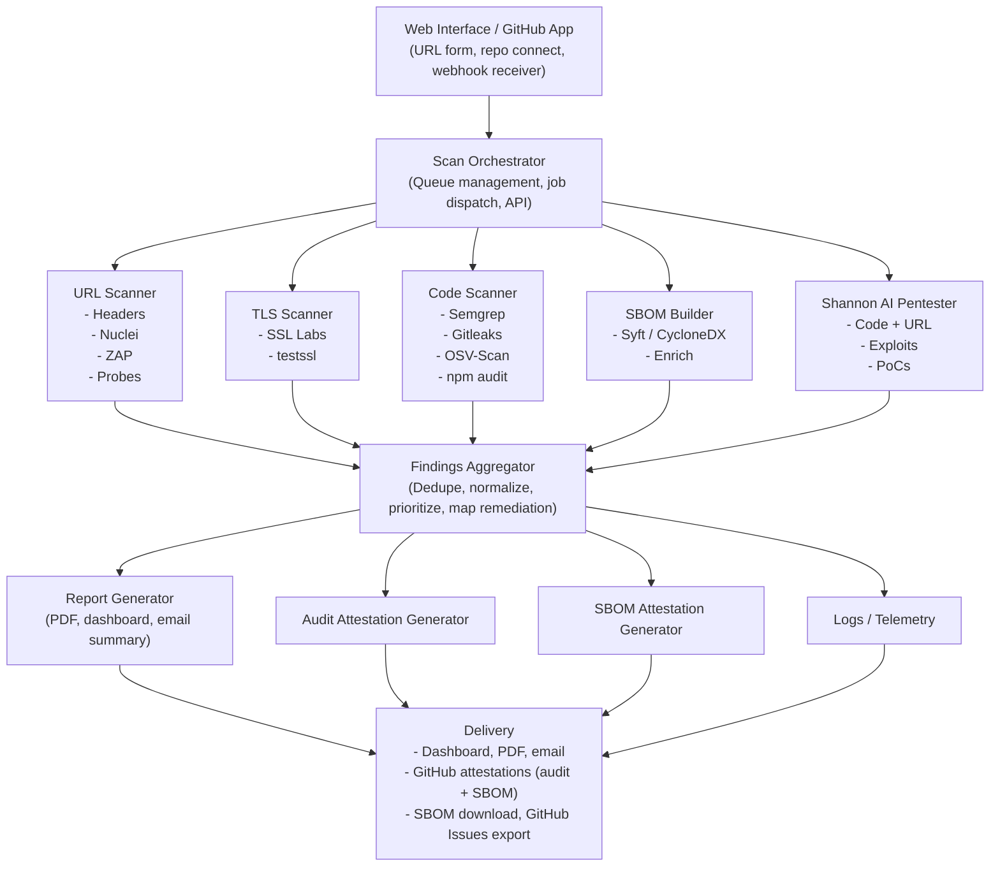
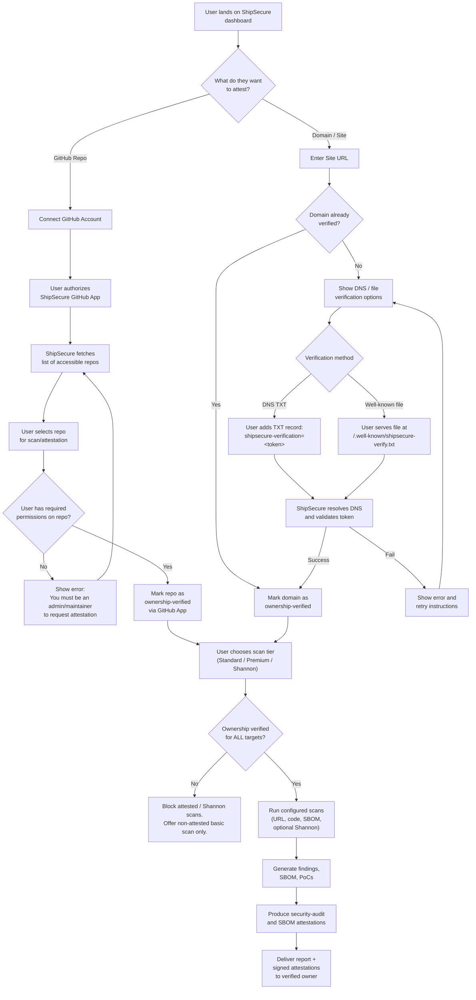

# ShipSecure Attested Security — Product Requirements Document

## Overview

ShipSecure Attested Security is an independent security audit, SBOM generation, and **cryptographic attestation** service for AI‑built (“vibe‑coded”) applications and GitHub-hosted projects. It consumes build provenance from CI (e.g., GitHub builds), runs targeted security analysis across URL, code, and dependencies, optionally performs exploit validation with an autonomous AI pentester (Shannon), generates a standards-compliant SBOM, and issues signed, machine‑readable attestations that downstream consumers can automatically verify.

## Target Users

- Indie devs and small teams shipping vibe‑coded apps (Cursor, Bolt, Lovable, Replit, etc.).
- Agencies building client apps rapidly with AI-assisted workflows.
- Security- or compliance-sensitive consumers of third‑party software who need verifiable assurance.
- Teams subject to EU Cyber Resilience Act, CISA SBOM guidance, FDA SBOM expectations, or federal procurement requirements.

## Core Problem

- Vibe‑coded apps ship fast but often lack sound security practices; research shows high defect rates in AI-generated code and weak security review in organizations adopting AI coding tools.
- Built‑in tools (CodeQL, Dependabot, platform scanners) are **first‑party** only:
  - Configurable and suppressible by the repo owner.
  - Results don’t travel with the artifact (no portable proof).
- Consumers of software have no cryptographic, third‑party proof that:
  - Security checks and SBOM generation were actually run.
  - Results were evaluated by an independent party.
- Regulatory pressure is accelerating:
  - EU CRA requires SBOMs for “products with digital elements,” with reporting obligations ramping in 2026.
  - CISA’s 2025 SBOM Minimum Elements raise the baseline for SBOM quality and completeness.
  - FDA and federal buyers increasingly expect SBOMs and secure development attestations.

---

## Product Concept

ShipSecure is an **independent security auditor that issues cryptographic attestations**, not “just another scanner.”

### Trust Chain

GitHub signs build provenance (SLSA) → ShipSecure runs independent audit → ShipSecure builds SBOM → ShipSecure emits signed attestations → Consumers verify full chain.

- GitHub provides first‑party provenance attestation (who built what, from where).
- ShipSecure adds third‑party security and SBOM attestations (how it was evaluated and what’s inside).
- Optional Shannon integration adds exploit validation (“we actively tried to break this and here’s what we found”).

---

## Key Features

### 1. Multi-Surface Security Analysis

**URL / App Surface**

- Security headers: CSP, HSTS, X‑Frame‑Options, X‑Content‑Type‑Options, Referrer‑Policy, Permissions‑Policy.
- TLS/cert posture: protocol support, cipher suites, expiration, weak signatures, known TLS vulns, HSTS preload, CAA, OCSP stapling.
- Exposed files/dirs: `/.env`, `/.git/config`, `/debug`, `/admin`, source maps, `/api-docs`, `/phpinfo.php`, etc.
- Client-side secret detection in JS bundles using Gitleaks-style regexes.
- Active scanning: Nuclei templates and OWASP ZAP baseline for common web vulns and misconfigurations.

**Code & Repo**

- Static analysis via Semgrep, including custom vibe‑code rulesets (Supabase anon key in frontend, client-side auth, direct DB queries from frontend).
- Secret detection: Gitleaks / TruffleHog for API keys, private keys, .env files, JWT secrets.
- Dependency analysis via npm audit, pip-audit, OSV-Scanner; optional license checks.
- Vibe‑code checks: Supabase RLS misconfig, Firebase security rules, Vercel/Netlify variable leaks and debug endpoints.

### 2. SBOM Generation & Attestation

- Generates a standards-compliant SBOM (CycloneDX or SPDX) as part of every repo-level scan, using tools like Syft/Trivy/CycloneDX CLI.
- Enriches SBOM with vulnerability context (linked CVEs, affected versions, risk notes) derived from dependency analysis.
- Signs and attests SBOM as a separate predicate (e.g. `https://shipsecure.ai/predicate/sbom/v1`) alongside the security audit attestation.
- Designed to meet CISA 2025 SBOM Minimum Elements and support CRA-aligned documentation.
- Available as:
  - Downloadable artifact (JSON/XML).
  - Attached SBOM attestation in GitHub via `actions/attest-sbom`.

### 3. Independent Security Attestation

Defines a custom **in‑toto attestation predicate** conforming to the SLSA attestation model.

**Predicate type:**  
`https://shipsecure.ai/predicate/security-audit/v1`

**Example predicate structure:**

```json
{
  "predicateType": "https://shipsecure.ai/predicate/security-audit/v1",
  "predicate": {
    "auditEngine": "shipsecure-v2.1",
    "scanTimestamp": "2026-02-07T23:30:00Z",
    "target": {
      "repoUrl": "https://github.com/user/app",
      "commitSha": "abc123...",
      "artifactDigest": "sha256:def456...",
      "primaryUrl": "https://app.example.com"
    },
    "findings": {
      "critical": 0,
      "high": 1,
      "medium": 3,
      "low": 7,
      "info": 12
    },
    "firstPartyStatus": {
      "codeqlEnabled": true,
      "dependabotEnabled": true,
      "openCriticalAlerts": 0
    },
    "sbomRef": "sha256:abc789...",
    "exploitValidation": {
      "engine": "shannon-lite-v1.x",
      "executed": true,
      "confirmedExploits": 0,
      "testedCategories": [
        "sqli",
        "xss",
        "ssrf",
        "idor",
        "auth_bypass",
        "jwt"
      ],
      "validationTimestamp": "2026-02-07T23:45:00Z"
    },
    "policyPass": true,
    "policyName": "shipsecure-default-v1",
    "reportUrl": "https://shipsecure.ai/reports/..."
  }
}
```

Properties

    Signed via Sigstore keyless for public repos or hardware-backed keys (YubiKey/KMS) for enterprise tier.

    Stored in GitHub’s attestation store via actions/attest, or published to a transparency log and verified with Cosign.

    Machine-readable for CI/CD policy engines (e.g., “block deploy if policyPass=false or confirmedExploits>0”).


4. GitHub-Centric Workflow

    GitHub App:

        Receives webhooks on push / release.

        Receives artifact metadata and build provenance from GitHub Artifact Attestations.

    Reusable GitHub Action (shipsecure/attest-security-audit@v1):

        Runs after build & tests.

        Retrieves artifact digest and environment info.

        Calls ShipSecure API to run analysis and (optionally) Shannon.

        Publishes security audit and SBOM attestations via actions/attest.

    For repos already using CodeQL/Dependabot:

        ShipSecure queries their status via GitHub API.

        Enriches attestation with first‑party scan status, rather than duplicating scans.

5. Human-Facing Reports & Remediation

    Web dashboard + downloadable PDF:

        Executive summary with severity breakdown and risk narrative.

        Findings grouped by surface (URL, code, dependencies, configuration).

        Vibe‑code‑specific sections (Supabase/Firebase, Vercel, etc.).

        Copy‑paste remediation playbooks for common issues (RLS, hardcoded secrets, missing headers, etc.).

        SBOM summary with top vulnerable components and update suggestions.

    Optional GitHub Issues export (user-imported) for tracking vulnerabilities in their normal workflow.

6. Exploit Validation (Premium, via Shannon)

    Integrates Shannon, an open-source autonomous AI pentester, as an optional deep validation pass.

    Shannon reads the codebase and actively probes the live app (staging/preview URL) to discover and exploit real vulnerabilities (SQLi, XSS, SSRF, IDOR, auth bypass, JWT attacks, etc.).

    Benchmarked at high success rates on web app benchmarks, comparable to or exceeding experienced human pentesters.

    Outputs only confirmed exploits with reproducible PoCs, dramatically reducing false positives.

    ShipSecure consumes Shannon’s results and:

        Embeds exploit stats in the attestation (exploitValidation block).

        Includes PoC details in the PDF report (sanitized, customer-visible form).

    Licensing / cost model:

        Uses Shannon Lite (AGPL-3.0) in a containerized, unmodified mode or licensed Pro edition, to respect licensing constraints.

        Runs only for premium tiers or one-off deep audits due to API token cost and runtime.

Architecture



Tech Stack

| Component       | Technology                                | Rationale                                  |
| --------------- | ----------------------------------------- | ------------------------------------------ |
| Backend         | Python (FastAPI) or Rust                  | Fast async, good OSS ecosystem             |
| Queue           | Redis + RQ or Celery                      | Simple job management                      |
| Database        | PostgreSQL                                | Proven, already in stack                   |
| URL/TLS Scans   | Nuclei, ZAP, testssl.sh, SecurityHeaders  | Proven web scanning tools                  |
| Code Scans      | Semgrep, Gitleaks/TruffleHog, OSV-Scanner | Best-in-class OSS SAST + secrets detection |
| SBOM            | Syft, CycloneDX CLI, Trivy                | Standard SBOM generators                   |
| Attestation     | Sigstore/Cosign, GitHub Actions/attest    | Standards-based signing                    |
| AI Pentester    | Shannon (Lite/Pro)                        | Autonomous exploit validation              |
| TLS (Free/Paid) | SSL Labs API v4 / testssl.sh              | Recognized grades + unlimited paid checks  |
| Reports         | WeasyPrint or Playwright PDF              | Clean, automated PDF generation            |
| Frontend        | Next.js / HTMX                            | Simple, modern, easy to iterate            |
| Payments        | Stripe + Bitcoin                          | Dual payment options                       |
| Hosting	  | VPS / DigitalOcean / Railway	      | Container-friendly, flexible               |
| GitHub Integr.  | GitHub App + reusable Action              | Webhooks, repo access, attestations        |

Product Tiers

| Tier              | Price           | Scope                  | SBOM                               | Attestation                          | Exploit Validation (Shannon)          |
| ----------------- | --------------- | ---------------------- | ---------------------------------- | ------------------------------------ | ------------------------------------- |
| Free              | $0              | URL only               | No                                 | No                                   | No                                    |
| One-Time Audit    | $49–99          | URL + repo             | Generated (download)               | No                                   | Optional add-on (paid)                |
| Pro               | $149/month      | URL + repo, continuous | Generated + attested (keyless)     | Security audit attestation           | No (or 1 run/month add-on)            |
| Agency/Enterprise | $299–499+/month | Multiple projects, SLA | Generated + attested (HW optional) | Audit attestation (HW-backed option) | Included for key projects / scheduled |



Additional revenue:

    One-off Shannon deep audits priced separately (e.g., $199–499 per target).

    Consulting upsells for remediation support.

    White-label reporting for agencies.

MVP Scope (6 Weeks)

Weeks 1–2: Core URL Scanner

    URL input, headers check, SSL Labs, exposed files, JS secret scan, basic UI + email.

Week 3: Nuclei + Vibe-Code Templates

    Containerized Nuclei, custom templates for Supabase/Firebase/Vercel, integrated into pipeline.

Week 4: Code Scanning + SBOM

    GitHub App for repo access, Semgrep + Gitleaks + OSV scanning, SBOM generation (CycloneDX via Syft), unified findings.

Week 5: Reports + Attestation

    PDF report generation (exec summary, findings, remediation, SBOM summary).

    Define final v1 security-audit predicate schema and SBOM predicate.

    Implement Sigstore keyless signing via GitHub actions/attest and Cosign.

    Publish shipsecure/attest-security-audit@v1 GitHub Action.

Week 6: Continuous Monitoring + Shannon (Pilot)

    Webhook-driven re-scan on push, automated attestation refresh.

    Cert expiration monitoring + alerts.

    Integrate Shannon in a controlled “beta” mode for staging URLs only; surface exploit stats in reports and attestation.

Success Criteria

    Developer integrates the GitHub Action and obtains a verifiable attestation (audit + SBOM) in < 10 minutes.

    Attestations pass verification checks using standard tools.

    SBOM output meets CISA 2025 Minimum Elements checklist.

    At least one early adopter runs a Shannon-powered deep audit and provides positive feedback on exploit clarity and remediation guidance.

Risk Mitigation

| Risk                             | Mitigation                                                                   |
| -------------------------------- | ---------------------------------------------------------------------------- |
| False positives                  | Conservative severity; Shannon PoC-backed findings for premium tier          |
| Legal liability from disclosures | No auto-created public issues; user-imported GitHub Issues only              |
| Rate limiting (SSL Labs, APIs)   | Use testssl.sh for paid tiers; apply rate limiting on free scans             |
| SBOM format fragmentation        | Support both CycloneDX and SPDX; default to CycloneDX                        |
| Licensing constraints (Shannon)  | Use unmodified container or formal Pro license; document clearly             |
| Regulatory landscape shifts      | Keep predicates extensible; monitor and track CISA/CRA/OMB updates           |


| Scope creep                      | Maintain strict MVP scope; feature-flag Shannon and advanced SBOM enrichment |

